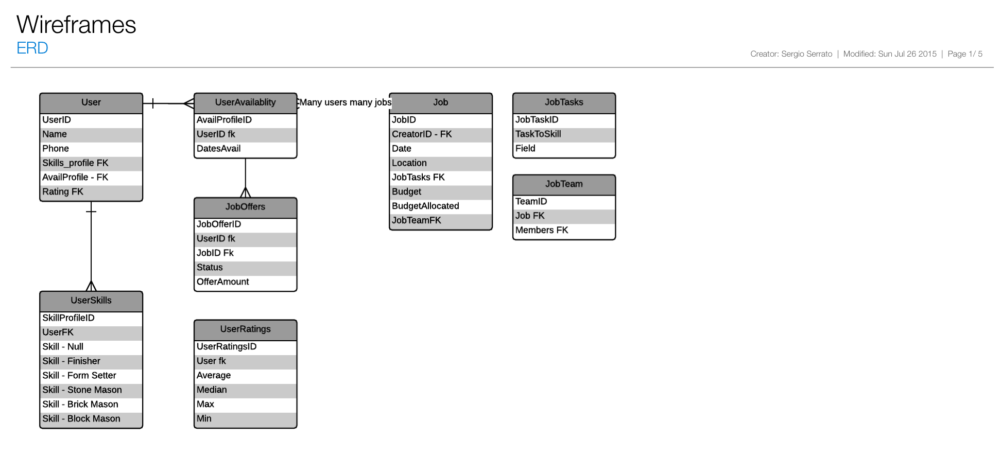
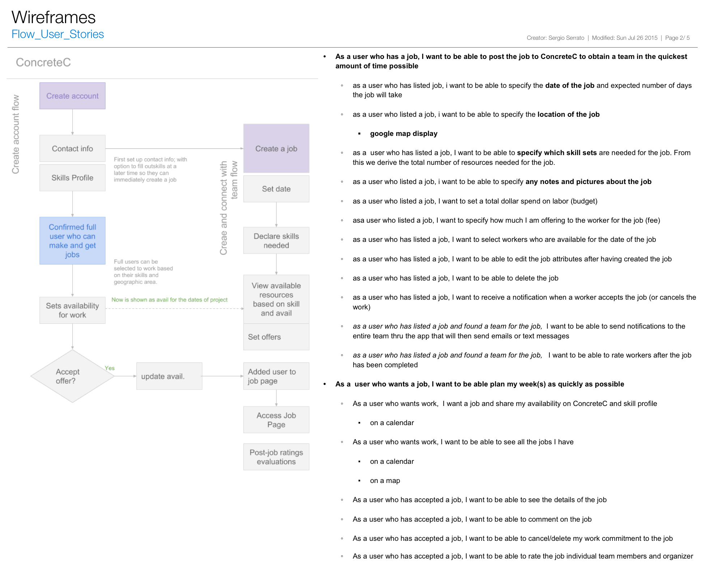
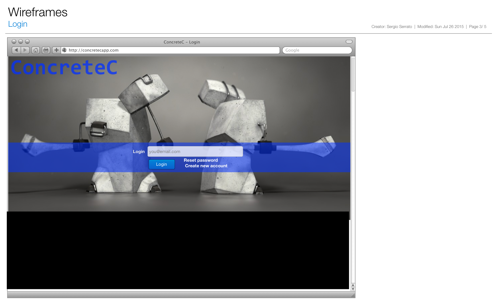
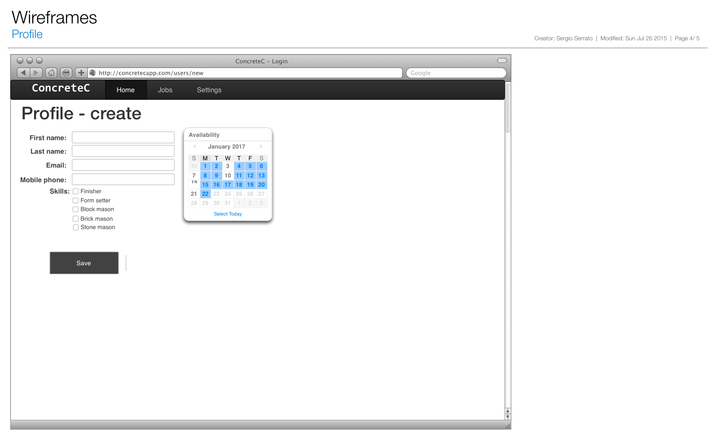
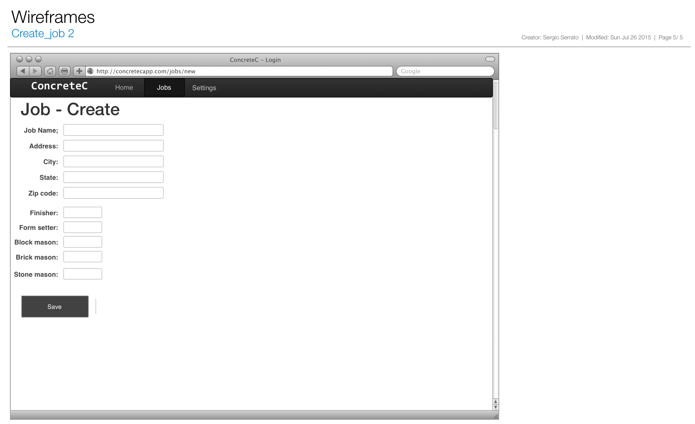

# ConcreteC
Ruby on Rails application for organizing teams in the informal economy. 

The informal economy is vast. The informal economy is activity that occurs outside regulation and paid for with cash.  As of 2013, informal economic activity was around 2 trillion dollars. As a point of reference official GDP in 2013 was 16.7 trillion dollars. All indicators point to growth in the informal economy. 
The US cement construction industry is on track to consume 97 million tons of cement in 2015. This is up 13% compared to 2014. A great deal of activity in this industry is within the informal economy. 

Organizing informal economic activity relies on social networks. In the concrete construction industry, it is time consuming assemble a qualified team. The current challenge is one of scheduling available resources. In times of economic slowdown, the social network for work is the key pipeline. Concrete Compadre seeks to speed the time to staff a project while decrease the time it takes to find work. 

Users will create a profile with ConcreteC and be able to set their skills and availability. Other users can create jobs and specify required skills and dates of the job. The job creator will then be able to select available users, offer them the job and staff the project. Once staffed, the users will be able to interact on the job page. Once the job is complete, all parties will be able to rate each other.

#ERD 

#USER STORIES & FLOW 

#SIGN UP MOCK 

#PROFILE MOCK 

#JOB MOCK 
